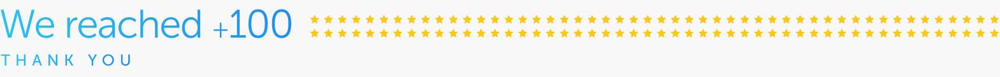
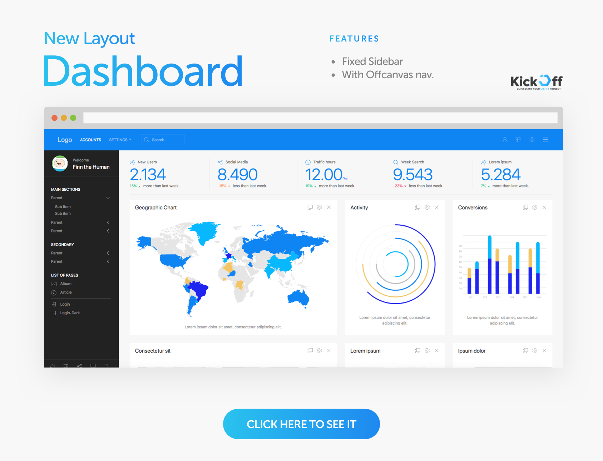
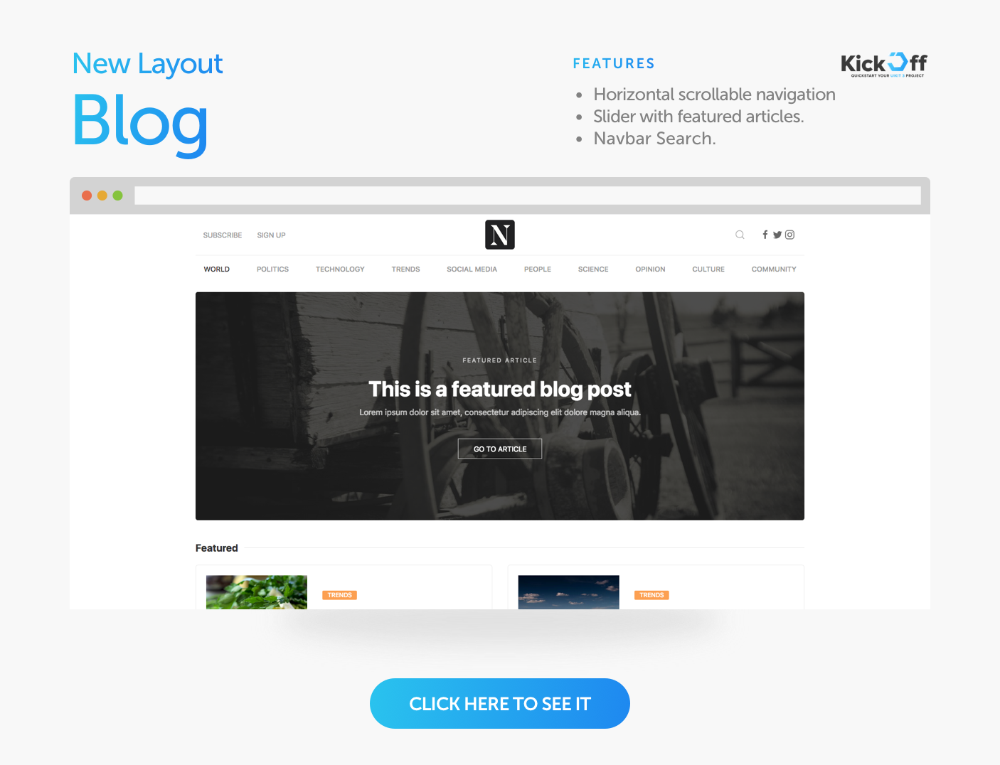
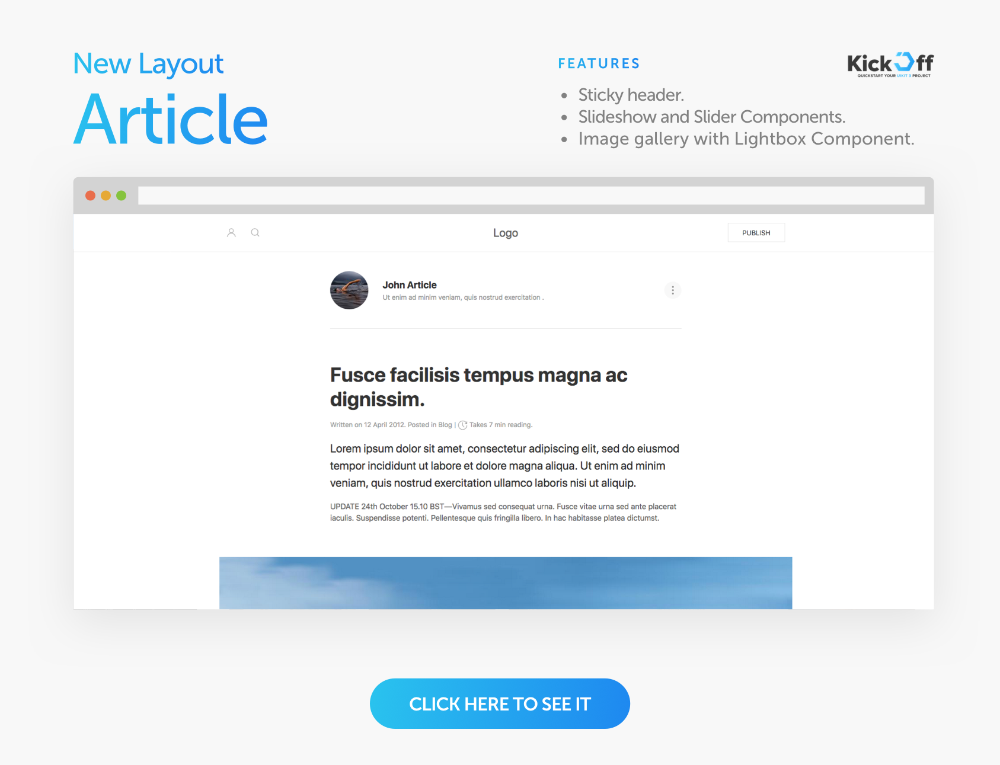
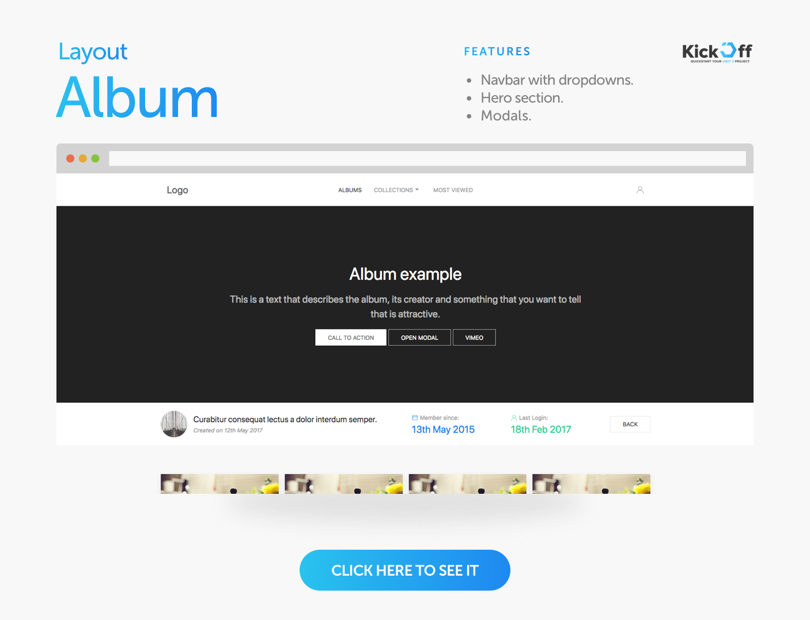
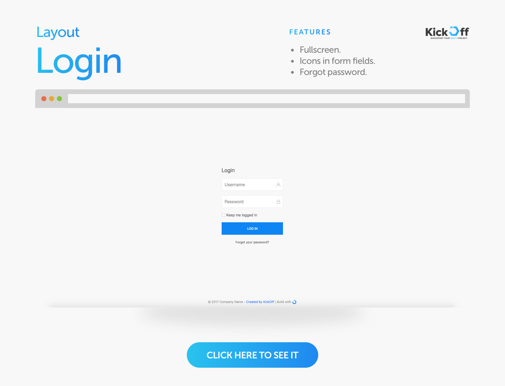

#### UIkit 3 Starter Layout / Templates for your UIKit 3 project.

### Goals

The main goal of KickOff is to <strong>quickly get you started on your project</strong> with <a href="https://getuikit.com/" target="_blank">UIkit 3</a>, bringing a <strong>solid layout foundation</strong> to work upon.

### CSS Styles

All the layouts are based on default UIkit styles to keeps things clean and simple, but some layouts may use some custom css code.

The css styles are the minified latest version of UIKit 3 ( currently 3.0.0-rc.6 ) from the cdn. 

*Next update when UIkit3 launch Stable Version.*

### HTML
The code try to be as simple as possible, with commented sections, <strong>validated and semantic</strong> html5 markup.

### JS

Since UIkit 3 removed JQuery dependancy, it´s not included. All JS implementations are created by adding `data-uk-*` attributes to the HTML elements. No additional JS lines are added.

The `uikit.min.js` file is the minified latest version of UIKit 3 ( currently 3.0.0-rc.6 ) from the cdn. 

*Next update when UIkit3 launch Stable Version.*

The `data-uk-*` syntax it´s used in order to work with every library and get html code validated.

### Components

All used components from UIkit 3 used in each layout are listed in order to know what is required.

### Images

All used pictures are random images from https://picsum.photos/

### The Layouts
At the moment these layouts are available ( more will be available soon! )

####  License
2018 byHumans under the [MIT license](LICENSE).

---

  <b>UIkit is an Open Source project developed by YOOtheme.</b>
    
  

---
