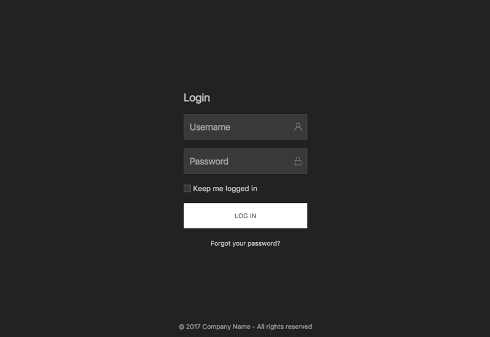

# Kick-Off 
Quick start for your UIkit project!

### Goals

UIkit 3 KickOff it´s a Github project, and the main goal is quickly get you started on your project with UIkit 3, bringing a solid layout foundation to work upon.

### CSS Styles

All the layouts are only using UIkit default styles, no extra css it´s added to keep things clean and simple.

The css styles are the minified latest version of UIKit 3 ( currently 3.0.0-beta.39 ) from the cdn, you can find it here.
HTML

The code try to be as simple as possible, with commented sections, validated and semantic html5 markup.

### JS

Since UIkit 3 removed JQuery dependancy, it´s not included. All JS implementations are created by adding `data-uk-*` attributes to the HTML elements. No additional JS lines are added.

The `uikit.min.js` file is the minified latest version of UIKit 3 ( currently 3.0.0-beta.39 ) from the cdn, you can find it here.

The `data-uk-*` syntax it´s used in order to work with every library and get html code validated.

### Components

All used components from UIkit 3 used in each layout are listed in order to know what is required.

### Layouts

At the moment this layouts are available ( will be more available soon! ):

|   |   |
| ------------- | ------------- |
|[ Album](https://zzseba78.github.io/Kick-Off/album.html)|[ Article](https://zzseba78.github.io/Kick-Off/article.html)|
|[ Dashboard](https://zzseba78.github.io/Kick-Off/dashboard.html)|[ Login](https://zzseba78.github.io/Kick-Off/login.html)|
|[ Login Dark](https://zzseba78.github.io/Kick-Off/login-dark.html)| 
